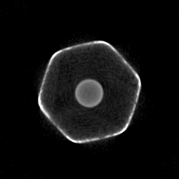
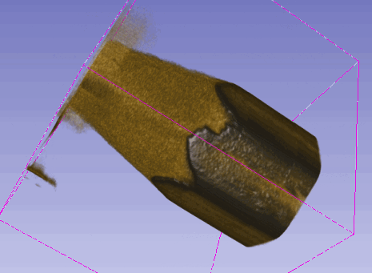

# CT Backprojection tools

 -->  --> 

This is a collection of tools for processing x-ray images from a CT scan into lateral 2D slices of the scanned object. The tools allow you to perform these steps:

1. Extract image data from MPX files - the raw binary integer format generated by the CT scanner
    * `mpxread` module
    * `mpx_read.py`, `mpx_view.py`
2. Transform this data, which initially represents detector counts, into data proportional to the x-rays' path integrals through the target
    * `ff_correct.py`
3. Process the images in various ways, including scaling, rotation, translation, de-noising (BM3D), and inpainting
    * `lf4/` module tools `mean.py`, `scale.py`, `to_image.py`, `transform.py`
    * `inpaint.py`
5. Generate backprojection slices from the images. This involves Fourier-space filtering, the Central Slice Theorem, and quite importantly the use of a small C+python module written by me (`cinterp`) to safely wrap the GNU Scientific Library's interpolation routines.
    * `make_projections.py`
    * `backproject.py`

Additionally there are tools not directly involved in the backprojection process:

6. Generate simulated x-ray projections of basic polygons, used to test the backprojection algorithm
    * `xray_project.py`
7. Quickly tab through a sequence of LF4 files, viewing them as colored images
    * `lf4/view.py` and the much faster `lf4view.py`

All of these tools work on a simple lowest-common-denominator format, the LF4 (**L**ittle-endian, **F**loating point, **4** byte number). It will store any float array of up to 255 axes, each axis length up to 65535.
The main advantage is that this format is trivial to read and write in any language. The main disadvantage is that the files are raw, uncompressed data and are therefore quite large.
